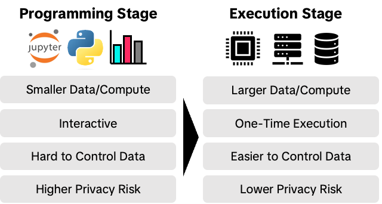

# PrivacyGo Data Clean Room

> Note: we are releasing an alpha version, which may miss some necessary features. 

PrivacyGo Data Clean Room (PGDCR) is an open-source project for easily building and deploying data collaboration framework to the cloud using trusted execution environments (TEEs).
It allows users to easily collaborate on private datasets without leaking privacy of individual data.
PGDCR achieves this by combining different privacy-enhancing technologies (PETs) in different programming stages.

In summary, PGDCR is great tool for data collaboration with the following features.

* **Interactive Programming**: PGDCR integrates with an existing Jupyter Notebook interface such that the data analysts can program interactively with popular languages like Python
* **Multiparty**: PGDCR allows multi-party data collaboration without needing to send the private data to each other
* **Cloud-Ready**: PGDCR can be easily deployed in TEEs in the cloud, including Google Confidential Space
* **Accurate Results**: PGDCR does not sacrifice accuracy for data privacy. This is achieved by a two-stage approach with different PETs applied to each stage.

### What is Different from Other Data Collaboration Frameworks?

Data collaboration is not a new concept, and numerous data collaboration frameworks already exist.
However, different frameworks try to apply different privacy-enhancing technologies (PETs), which have different strengths and weaknesses.
PGDCR tries to utilize different PETs in different programming stages to maximize the usability while protecting individual data privacy.
Specifically, PGDCR divides data analytics in two stages: *Programming Stage* and *Secure Execution Stage*.



In Programming Stage, the data scientist uses Jupyter Notebook interface to explore the general data structure and statistical characteristics. 
The data providers can determine how they protect privacy of their data. 
For example, they can use differentially-private synthetic data, completely random data, or partial public data.
This means that the it mathematically limits the leakage of privacy of individual data records.
The finished notebook files can then be submitted to the Secure Execution Stage.

In Secure Execution Stage, the submitted notebook file is built into an image, and scheduled to a confidential virtual machine (CVMs) in the cloud.
The data providers can set up their data such that only *attested* program can fetch the data. 
By using attestation, the data providers can control which program can access their data. 
TEE also assures the data scientists that the integrity of their program and the legitimacy of the output from executions by providing JWT-based attestation report.

### Use Cases

There are many potential use cases of the PGDCR:

* **Trusted Research Environments (TREs)**: Some data may be valuable to various research on public health, economic impact, and many other fields.
TREs are a secure environment where authorized/vetted researchers and organizations can access the data. The data provider can choose to use PGDCR to build their TRE.
Currently, [TikTok's Research Tools Virtual Compute Environment (VCE)](https://developers.tiktok.com/doc/vce-getting-started) is built on top of PGDCR.

* **Advertisement and Marketing**: Ads is a popular use case of data collaboration frameworks. PGDCR can be used for [lookalike segment analysis](https://en.wikipedia.org/wiki/Lookalike_audience) for advertisers, or [Ad Tracking](https://en.wikipedia.org/wiki/Ad_tracking) with private user data.

* **Machine Learning**: PGDCR can be useful for machine learning involving private data or models. For example, a private model provider can provide their model for fine-tuning, but do not reveal the actual model in the Programming Stage.

### Project Status

We are releasing an alpha version, which may miss some necessary features.

|                         | Current (Alpha)          | Future                    |
|-------------------------|--------------------------|---------------------------|
| **Users**               | One-Way Collaboration    | Multi-Way Collaboration   |
| **Backend**             | Single Backend (Goole Cloud Platform)     | Multiple Backend          |
| **Data Provisioning**   | Manual                   | Automated                 |
| **Policy and Attestation** | Manual                | Automated                 |
| **Compute**             | CPU                      | CPU/GPU                   |

# Getting Started

## Prerequisites
* A valid GCP account that has ability to create/destroy resources. For a GCP project, please enable the following apis:
    - serviceusage.googleapis.com
    - compute.googleapis.com
    - container.googleapis.com
    - cloudkms.googleapis.com
    - servicenetworking.googleapis.com
    - cloudresourcemanager.googleapis.com
    - sqladmin.googleapis.com
    - confidentialcomputing.googleapis.com
* [Gcloud CLI](https://cloud.google.com/sdk/docs/install) Login to the GCP `gcloud auth login && cloud auth application-default login`
* [Terraform](https://developer.hashicorp.com/terraform/tutorials/aws-get-started/install-cli) Terraform is an infrastructure as code tool that enables you to safely and predictably provision and manage infrastructure in any cloud.
* [Helm](https://helm.sh/docs/intro/install/) Helm is a package manager for Kubernetes that allows developers and operators to more easily package, configure, and deploy applications and services onto Kubernetes clusters.
* [Hertz](https://github.com/cloudwego/hertz) Hertz is a high-performance, high-usability, extensible HTTP framework for Go. It’s designed to make it easy for developers to build microservices.

## Deploying in Google Cloud Platform (GCP)
### Defining environment variables
First, determine whether there are multiple developers deploying simultaneously in your environment. If yes, use the multiple users template, otherwise use the single user template. 
```
# multiple users
cp .env.multiusers .env
```
```
# single user
cp .env.singleuser .env
```
Edit the variables in `.env`. The `.env` file is the one that really takes effect, the other files are just templates. The double quotes around a variable name are needed. For example:
```
env="dev"                        # the deployment environment
username="mock developer name"   # the developer name
mysql_username="mockname"        # mysql database username 
mysql_password="mockpwd"         # mysql database password
project_id="you project id"      # gcp project id
project_number="1310xxxx092"     # gcp project number
region=""                        # the region that the resources created in
```

### Preparing resources
Create resources for the data clean room by terraform. Make sure you have correctly defined environment variables in the `.env`.

`resources/gcp` directory contains the resources releated to the gcp including: clusters, cloud sql instance, database, docker repositories, and service accounts. These resource are global and only created once for all the developers in one project.

`resources/kubernetes` directory includes the resources releated to the kubernete cluster including: namespace, role, secret.

Create all the resources by:
```
pushd resources
./apply.sh
popd
```

### Building docker images
`app` directory contains the source codes of the data clean room which has three components:

* `dcr_tee` contains tools that are used in the base image of stage2 such as a tool generates custom attestation report within GCP confidential space.
* `dcr_api` is the backend service of the data clean room that processes the request from jupyterlab. 
* `dcr_monitor` is a cron job that monitors the execution of each job. The monitor is deployed to Kubernetes cluster and scheduled to run every minute.
* `jupyterlab_manatee` is an JupyterLab extension for data clean room that submits a job on the fronted and queries the status of the jobs.

Pass parameters to build.sh to determine which component to compile. If no parameters are provided, all of them will be built.
```shell 
pushd app
./build.sh # build all
# only build dcr_tee
./build.sh dcr_tee
# only build dcr_api
./build.sh dcr_api
# only build dcr_monitor
./build.sh dcr_monitor
# only build jupyterlab_manatee
./build.sh jupyterlab_manatee
popd
```
If everything goes well, four docker images will be built. They are:
* data-clean-room-base, built by `dcr_tee` directory.
* data-clean-room-api.
* data-clean-room-monitor.
* scipy-notebook-with-dcr, built by `jupyterlab_manatee` directory.

### Deploying 
Deploy data clean room and jupyterhub by helm chart.
```shell 
pushd deployment
./deploy.sh
popd
```
When deployment is complete, you can follow the output of the script to get the public ip of jupyterhub. 
```
kubectl --namespace=$(your namespace) get service proxy-public
```
